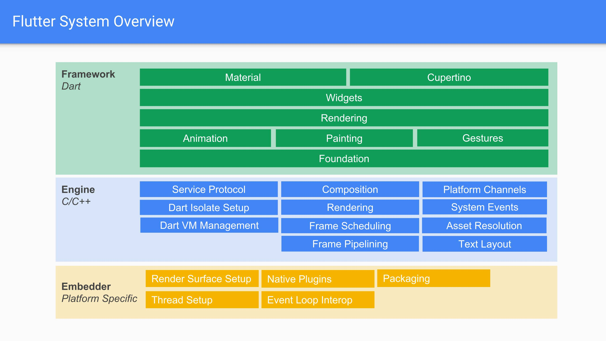

This is a case study on Flutter, a new cross-platform mobile development framework.

## Overview
Flutter is an SDK developed by Google for creating mobile interfaces for applications easily and quickly. Flutter is an open-source project used in many applications, and its goal is to enable developers to craft interfaces that function well, look good, and are not complicated. Some of its core features include a fully customizable and flexible UI, a responsive interface, and integration with existing tools like Java, Kotlin, Objective C, and Swift code, platform APIs, and 3rd party SDKs.

To see further report on the case study, look under docs/
## Architecture


## Example Code 
1. To install flutter, follow instructions from the following link
https://flutter.dev/docs/get-started/install

2. To run this hello-world application, run
```
flutter run
```